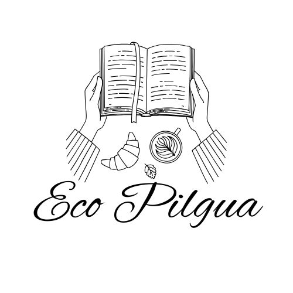
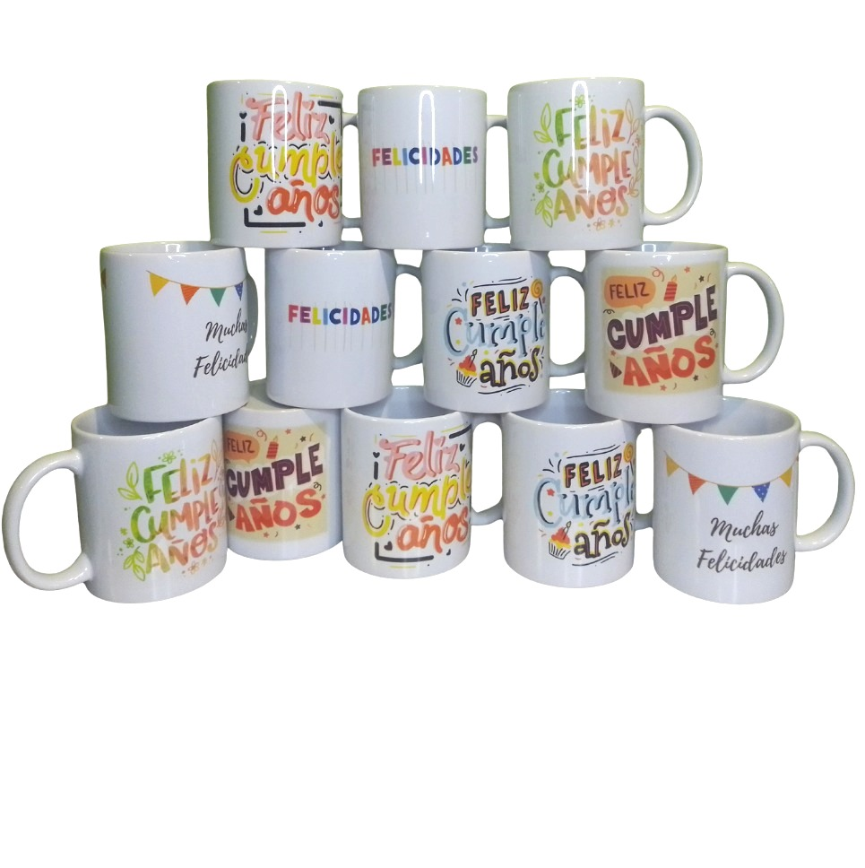
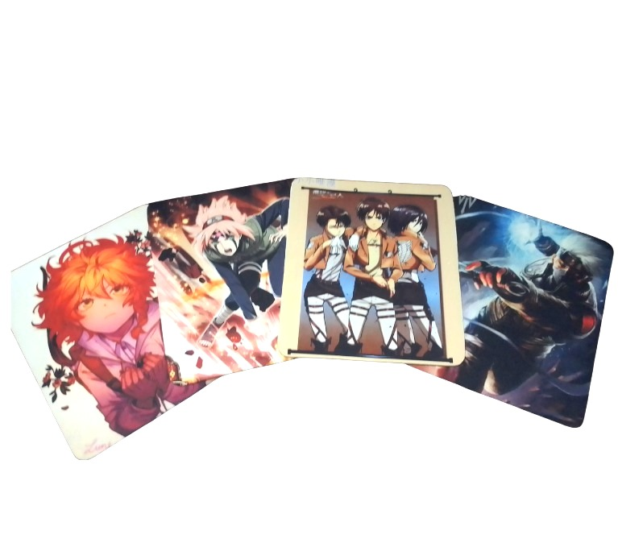
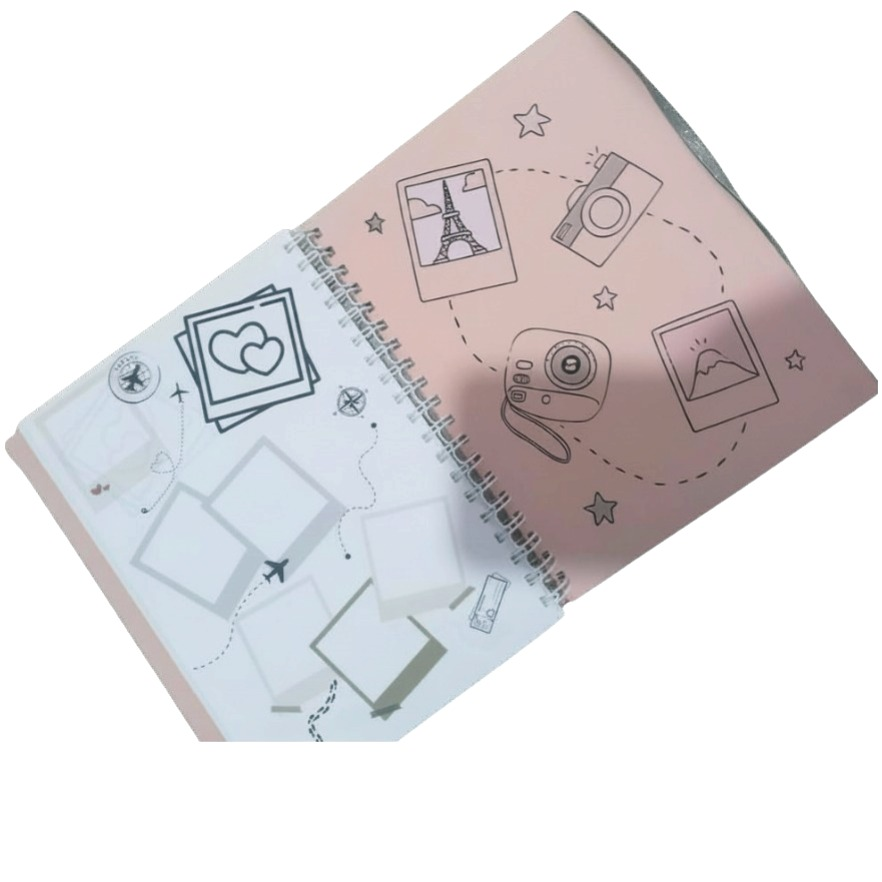

ASIGNATURA			: DISEÑO WEB 

AÑO				: 2026 

EVALUACIÓN NÚMERO	: 1 

FECHA	DE ENTREGA		: 07 DE ABRIL DE 2026. 

INTEGRANTES	 GRUPO II	: ALEJANDRA XIMENA FREDES VELOZO 

  BRIAN RODRIGO BROWN COOPMAN 

  MARIA CAMILA CALLE HOLGUIN 

  DAVID NEFI CAMPOS VALDIVIA 

  VANESSA MACARENA RIFFO ROJAS 

  FELIPE GONZALO ROSALES LILLO 

DOCENTE			: FELIPE IGOR FLORES VALDEBENITO. 

LINK 				: https://github.com/Brianbrowncoopman/ecopilgua  

 

 

INFORME DE ENTREGA 

 

Introducción 

 

El presente informe tiene como propósito describir el proceso de desarrollo de un MockUp de página web, elaborado en el contexto de la asignatura de Diseño Web, mediante la asignación grupal de un emprendimiento particular. Esta actividad tuvo como objetivo principal aplicar los conocimientos básicos del lenguaje HTML, permitiendo construir la estructura inicial de un sitio web de manera ordenada y funcional. 

A modo global, para alcanzar los propósitos requeridos, se implementaron habilidades de planificación, organización de contenidos y trabajo en equipo, aspectos que son considerados fundamentales en el desarrollo de proyectos web. De esta manera, se logró cumplir con los requerimientos, desarrollando un MockUp que refleja la estructura básica de una página web. 

 

Descripción de los requerimientos 

 

Para la realización del mockup, se trabajó con la información proporcionada del emprendimiento Eco Pilgua, la cual incluyó un documento Word con toda la información, tales como descripción, misión, visión, productos, redes sociales y testimonios. A su vez, material visual disponible en archivos comprimidos para favorecer los elementos a integrar dentro del producto final. El trabajo fue organizado utilizando etiquetas HTML adecuadas, logrando representar de forma clara la identidad del emprendimiento. 

 

Desarrollo 

 

A continuación, se presenta el desarrollo paso a paso de cada una de las actividades que permitieron alcanzar el desarrollo del producto requerido. 

Imágenes a utilizar: Se selecciona el logo de la empresa, y tres imágenes dentro de la carpeta facilitada por el docente, las que fueron corregidas en CANVA para quitar el fondo. Esto, dado que las imágenes no contenían un perfil profesional, sino que de usuario. 

 

 

 

 

 

 

 

 

 

 

 

 

 

 

 

 

 

 

 

Encabezado:  

Sintaxis: Se realiza la configuración suficiente para dejar el logo de la empresa al inicio, como también, el título Eco Pilgua de la pestaña. También, se deja un header con el hipervínculo a cada uno de los títulos como contenido, para facilitar el acceso. La etiqueta <head> apunta al idioma español y permite cargar el logo en la pestaña del browser. 

 

<!DOCTYPE html> 

<html lang="es"> 

<head> 

    <meta charset="UTF-8"> 

    <meta name="viewport" content="width=device-width, initial-scale=1.0"> 

    <title>Eco Pilgua</title> 

    <link rel="icon" type="image/x-icon" href="src/Logo.jpg"> 

</head> 

<body> 

    <header id="Inicio"> 

        <a href="index.html">Inicio</a> 

        <a href="#Mision">Misión</a> 

        <a href="#Vision">Visión</a> 

        <a href="#Productos">Productos</a> 

        <a href="#Testimonios">Testimonios</a> 

        <a href="#Contacto">Contacto</a> 

        <a href="#Redes">Redes Sociales</a> 

         

    </header> 

 

Resultado web: 

 

 

Título, descripción, misión y visión:  

Sintaxis: En este punto, a través de una etiqueta main se configuran las secciones de título como Eco Pilgua en tamaño mayor, la descripción que se realiza en forma de pregunta ¿Qué es Eco Pilgua?, misión y visión en tamaño siguiente (h2).  

    <main> 

        <section> 

            <h1>Eco Pilgua</h1> 

        </section> 

         

          

        <h2>¿Qué es Eco Pilgua?</h2> 

        
 

            Somos un emprendimiento dedicado a la creación de productos personalizados que 

            transforman ideas en piezas únicas llenas de color, emoción y significado. 

        
 

 

          

        <section id="Mision"> 

            <h3>Misión</h3> 

            
  

                Nuestra misión es acompañar a cada cliente desde la inspiración hasta el  

                resultado final, entregando productos de papelería creativa y sublimación  

                que combinan diseño, funcionalidad y cariño, fomentando la expresión personal 

                y el valor del trabajo hecho a mano. 

            
 

        </section> 

 

          

        <section id="Vision"> 

            <h3>Visión</h3> 

            
 

                La visión de Eco Pilgua es ser una marca reconocida a nivel nacional por su 

                creatividad, rapidez y compromiso con cada cliente, consolidándose como un 

                referente en papelería creativa y productos sublimados, impulsando la sostenibilidad, 

                la innovación y el espíritu emprendedor local. 

            
 

        </section> 

 

          

 

Resultado web: 

 

 

 

Productos y servicios: Se prosigue con la sección de productos y la de servicios, dándole formato de título con el tamaño de letra mayor en h1. En esta sección se deja un breve texto y se configuran las imágenes a mostrar. 

Sintaxis:  

        <section id="Productos"> 

            <!--<h2>-----------------------------------------</h2>--> 

            <h2>Productos y Servicios</h2> 

            
En Eco Pilgua ofrecemos una amplia gama de productos personalizados que incluyen papelería creativa y sublimación.
 

            <section> 

                 

                 

                 

            </section> 

        </section> 

 

Resultado web: 

 

 

Testimonios: Se configura la sección de testimonios como información complementaria, donde se dejan tres principales.  

Sintaxis:  

        <section id="Testimonios"> 

            <!--<h2>-----------------------------------------</h2>--> 

            <h2>Testimonios</h2> 

            
 

                <h5>  

                    “Le conté mi idea y en minutos ya tenía el diseño, quedó hermoso.  

                    ¡Atención rápida y 100 % personalizada!” 

                </h5> 

                <h6> 

                    — Carolina, cliente frecuente.  

                </h6> 

            
 

              

            
 

                <h5>  

                    “Los productos de Eco Pilgua son preciosos y duraderos. Siempre recibo elogios  

                    por los tazones y cuadernos personalizados. Son el mejor regalo que pudimos entregar  

                    a la profesora de mis hijas”. 

                </h5> 

                <h6>— Danae, cliente frecuente.</h6> 

            
 

              

            
 

                <h5>  

                    “Excelente atención y compromiso, todo llega a tiempo y con una presentación impecable.” 

                </h5> 

                <h6>— Cindy M., enfermera.</h6> 

            
 

        </section> 

 

Resultado web: 

 

 

 

Redes sociales y contacto: Se configuran las secciones de redes sociales y contacto, para mostrar los principales enlaces para acceder a visualizar contenido, como también, poder obtener tanto el correo como el número de teléfono de la plataforma WhatsApp para mejorar la comunicación directa (como información complementaria al requerimiento).  

Sintaxis:  

<section id="Redes"> 

            <h2>Redes Sociales</h2> 

             

            <a href="https://www.instagram.com/ecopilgua/" target="_blank"> 

                <h4>Instagram</h4> 

            </a> 

 

            <a href="https://www.facebook.com/Ecopilgua2" target="_blank"> 

             

                <h4>Facebook</h4> 

            </a> 

 

            <a href="https://www.tiktok.com/@ecopilgua" target="_blank"> 

                <h4>TikTok</h4> 

            </a> 

        </section> 

          

         

        <section id="Contacto"> 

            <h2>Contacto</h2> 

 

            <a href="https://wa.me/56932776583" target="_blank">     

                <h4>WhatsApp</h4> 

            </a>     

 

            <h4>Correo: ecopilgua@gmail.com</h4> 

        </section> 

 

    </main> 

 

 

 

 

Resultado web: 

 

 

Link de regreso a la zona inicial: Finalmente, se configura un hipervínculo para regresar a la sección superior de la página.  

Sintaxis:  

      

    <a href="#Inicio">Regresar arriba</a> 

      

         

Resultado web: 

 

 

 

 

 

 

 

 

 

 

Resultado final: De este modo, el proyecto se visualiza de la siguiente manera: 

 

 

 

 

 

 

 

 

Reuniones: Se realizaron tres principales reuniones para avanzar en el trabajo.  

Primera reunión de configuración de sintaxis:  

 

 

Segunda reunión de validación: 

 

 

 

 

 

 

 

 

 

Tercera reunión de aprobación de informe final: 

 

 

 

Conclusión 

 

En conclusión, el desarrollo de este trabajo en equipo permitió al grupo aplicar de manera práctica los conocimientos básicos de HTML y para la creación de un MockUp de página web para Eco Pilgua, ocupando los requerimientos que fueron entregados para el emprendimiento por el docente. La recopilación de la información fue fundamental para organizar correctamente todo el contenido y representar de forma clara la identidad del negocio. Por otra parte, esta actividad permitió comprender la importancia de una correcta estructuración del contenido antes del diseño final del sitio web para el emprendedor. El MockUp fue desarrollado en Visual Studio Code utilizando una estructura sencilla y funcional cumpliendo con los objetivos planteados en la asignatura y reflejando de manera ordenada la información del emprendimiento.  

                

 

 

 

 

Comentarios y observaciones relevantes 

 

Trabajo colaborativo: 

Durante el desarrollo del MockUp, se observó una coordinación efectiva entre los integrantes del equipo, lo que permitió distribuir las tareas de manera equitativa y cumplir con los tiempos establecidos. 

Organización de la información: 

La información proporcionada por el profesor con los antecedentes de la emprendedora de Eco Pilgua fue completa y clara, lo que facilitó la estructuración del MockUp y permitió representar el requerimiento del emprendimiento en la página web. 

Uso correcto de HTML: 

Se utilizó de manera adecuada etiquetas semánticas, cumpliendo con los criterios de evaluación de la asignatura. 

Aprendizaje y mejora: 

La actividad permitió identificar la importancia de planificar el contenido antes de desarrollar la página web y reforzó las habilidades en el uso de HTML básico, así como la comunicación dentro del equipo de trabajo. 

 

Aporte individual 

 

Brian Brown contribuyó en la creación de la sintaxis y Mockup del proyecto. También, en garantizar el respaldo del trabajo en GitHub.  

Alejandra Fredes y María Camila Calle iniciaron la redacción del informe completo, tomando en consideración los aspectos de forma y contenido estipulados en los requerimientos.  

Vanessa Riffo contribuyó en la redacción de la descripción y sus elementos. 

David Campos realizó la búsqueda exhaustiva de la información particular del emprendimiento asignado, para garantizar el uso de información complementaria a disponer en la web.  

Felipe Rosales contribuyó en la selección de las imágenes, su modificación y edición, la revisión de los antecedentes de la emprendedora para búsqueda de información adicional y el ajuste de los verificadores del informe. 

A modo general, todos los integrantes del equipo contribuyeron en cada una de las actividades del proyecto en distinta medida, con sus respectivos liderazgos por tarea. Cada una fue revisada, discutida, modificada y validada en su conjunto, para fortalecer la toma de decisiones. Ello, garantizó el trabajo en equipo con funciones específicas que contribuyeron al logro de los resultados esperados. 
